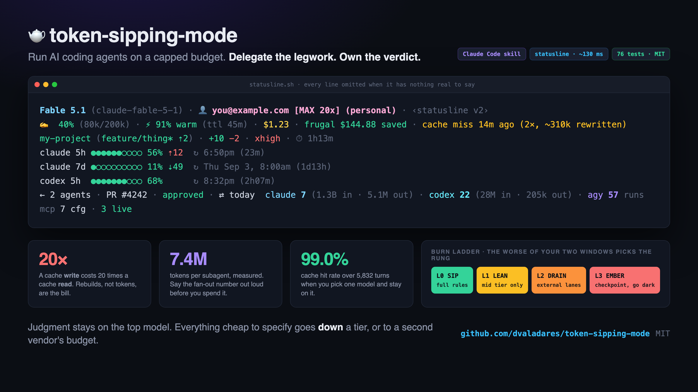
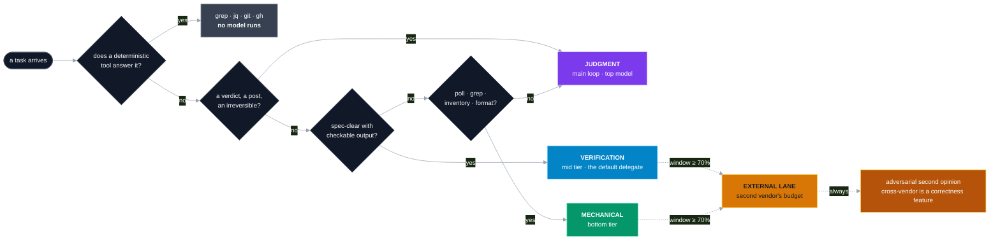
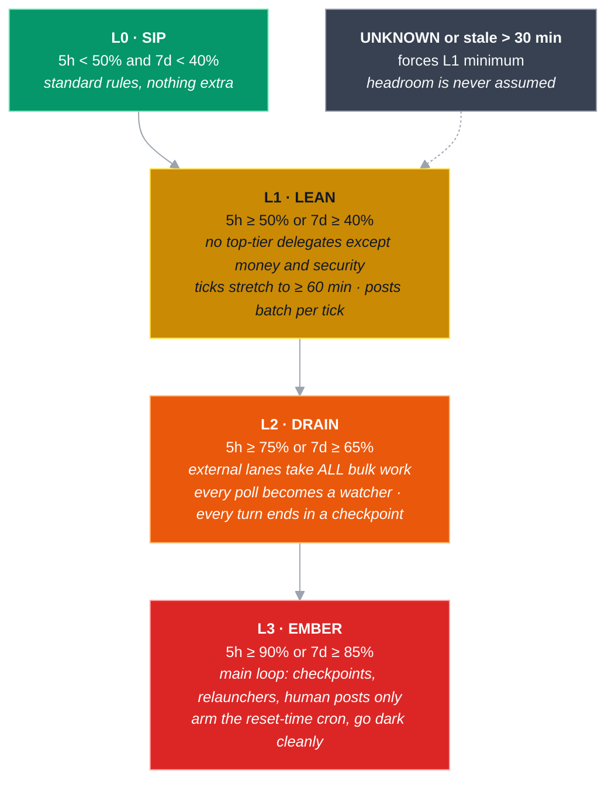
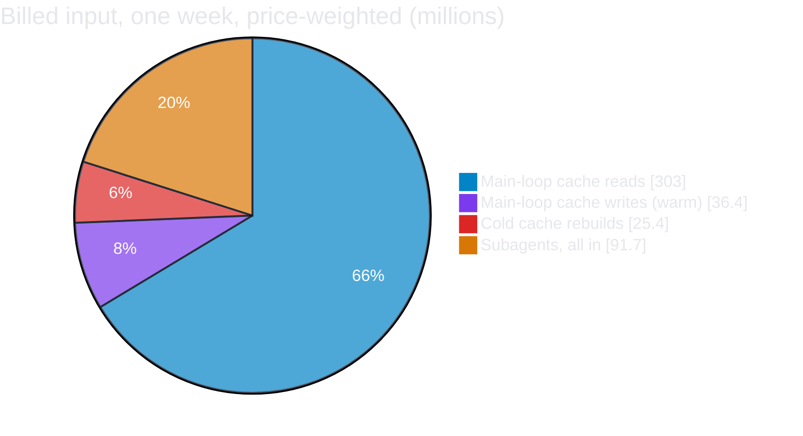
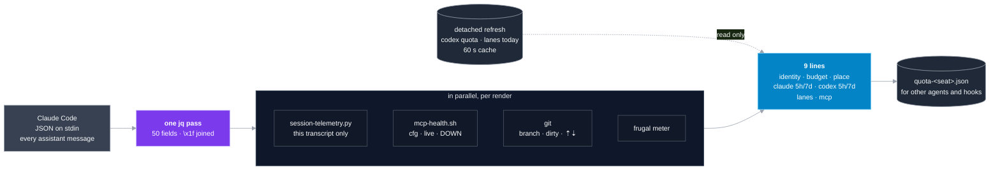

<h1 align="center">🫖 token-sipping-mode</h1>

<p align="center">
  <strong>Delegate the legwork. Own the verdict.</strong><br/>
  An operating mode, a statusline, and a set of honest gauges for AI coding agents that live on a capped token budget.
</p>

<p align="center">
  
  
  
  
  
</p>

<p align="center">
  <a href="#-the-one-law">The law</a> ·
  <a href="#-routing-every-task-down">Routing</a> ·
  <a href="#-the-burn-ladder">Burn ladder</a> ·
  <a href="#-the-arithmetic-measured-not-guessed">Arithmetic</a> ·
  <a href="#-the-statusline">Statusline</a> ·
  <a href="#-install">Install</a> ·
  <a href="#-any-other-harness">Other harnesses</a>
</p>

<p align="center">
  
</p>

---

## 🧭 Why this exists

Frontier models are billed like jet fuel. A 5-hour window, a weekly window, a
subscription tier, an overnight run that must survive until morning. Most agent
setups spend that fuel on the wrong thing: the top model greps, polls, tails logs,
and re-reads files it wrote a minute ago.

This kit flips it. **The expensive model in your main loop spends tokens on exactly
one thing, judgment.** Everything that is cheap to specify fans out to cheaper models,
or to a second vendor's CLI that burns a separate budget entirely. A statusline keeps
the budget in front of your eyes so the routing is a reflex, not a memory.

It was built over one summer of running two Claude accounts, a Codex lane, a Gemini
lane, and a local model, across long unattended sessions. Every rule in here was paid
for once, in tokens, before it was written down.

```
Fable 5.1 (claude-fable-5-1) · 👤 you@example.com [MAX 20x] (M2) · ‹statusline v2›
✍️  40% (80k/200k) · ⚡ 91% warm (ttl 45m) · $1.23 · frugal $144.88/$8,220.96 saved · cache miss 14m ago (2×, ~310k rewritten)
my-project (feature/thing* ⇡2) · +10 −2 · xhigh · ⏱ 1h13m
claude 5h ●●●●●●○○○○ 56% ⇡12  ↻ 6:50pm (23m)
claude 7d ●○○○○○○○○○ 11% ⇣49  ↻ Thu Sep 3, 8:00am (1d13h)
codex 5h  ●●●●●●●○○○ 68%      ↻ 8:32pm (2h07m)
← 2 agents · PR #4242 · approved · ⇄ today  claude 7 · codex 19 (26.7M tok) · agy 35 runs
mcp 7 cfg · 3 live
```

That `frugal $8,220.96 saved` is one operator's lifetime meter as of September 2026.
It is not vibes. It is the difference between what delegated work would have cost at
top-model prices and what it actually cost at the tier it ran on.

## 📦 What is in the box

| Piece | What it does |
|---|---|
| [`SKILL.md`](SKILL.md) | The operating mode: routing table, burn ladder, delegation contract, spend rules, the measured arithmetic, and the anti-pattern list |
| [`statusline/statusline.sh`](statusline/statusline.sh) | A session-scoped statusline for Claude Code. Nine lines, each omitted when it has nothing real to say. [Field guide](statusline/README.md) |
| [`statusline/gauges/`](statusline/gauges/README.md) | The readers behind it: per-session prompt-cache telemetry, two-window codex quota, MCP health, and `lanes.sh`, the one-call burn probe that prints the ladder rung |
| [`statusline/frugal/`](statusline/frugal/) | The frugal meter: a `SubagentStop` hook that logs every delegate run, and the script that turns the log into dollars saved |
| [`statusline/tests/`](statusline/tests/) | 76 render cases and a suite per gauge. Every gauge is proven to fire **and** to stay quiet |

## ⚖️ The one law

> Route each task **down** to the cheapest tier that can do it correctly.

- **Judgment stays home.** Verdicts, synthesis, risk calls, anything that lands, posts,
  or gets graded: the main loop, on the best model you have.
- **Verification goes mid-tier.** Spec-clear multi-step work with checkable output.
- **Mechanical goes bottom-tier.** Polls, greps, inventories, format checks.
- **Deterministic tools beat every model.** If `grep`, `jq`, `git` or `gh` answers it,
  no model runs at all. Not even the cheap one.
- **Second vendors are free capacity.** Their budget is not your budget.

## 🚦 Routing every task down



The tiers are roles, not brand names. Map them onto whatever you have: a judgment
model, a verification model, a mechanical model, and any second-vendor lane.

## 🌡️ The burn ladder

Every rule above assumes you know how much budget is left. The ladder makes that
knowledge automatic. `statusline/gauges/lanes.sh` reads the worst of your two Claude
windows and prints the rung. Obey the rung; do not re-derive it.



## 🧮 The arithmetic, measured not guessed

One full week of real spend on one seat, read from the API's own billing fields:

| | |
|---|---|
| Main-loop turns | 5,832 |
| Read from cache | 3.03 B tokens |
| Written to cache | 30.9 M tokens |
| Fresh input | 189 K tokens |
| Cache hit rate | **99.0 %** |
| Subagents | 82 agents, 5,063 turns, 606 M raw tokens |

Billing weights make raw counts lie: **a cache read costs 0.1×, a 1-hour cache write
2×, fresh input 1×.** A written token is twenty times dearer than a read one. Weighted
by price, this is where the week's input actually went:



**Fan-out is the lever. Cache hygiene is the side dish.** Four rules fall out of it:

1. **Say the fan-out number out loud before spending it.** Measured average: ~7.4 M raw
   tokens per subagent. Ten agents is ~74 M. If the sentence sounds absurd, restructure.
   One ambitious audit measured at 11.7 M subagent tokens cost as much as every cache
   rebuild that week combined.
2. **One model per session.** Caches are per model. A mid-session switch measured
   675 K write tokens one way and 272 K the other. Pick the model for the hardest task
   and stay on it.
3. **Check MCP health at session start.** The tool list sits at byte one of every
   request. A dead server silently changes it and costs a full rebuild on every start.
   One expired SSO token measured 153 K tokens per restart for three days.
4. **Name what you do not know, or do not fan out.** A brief that cannot state its
   unknowns is not ready to spend.

## 📟 The statusline

A statusline is a budget you can see. This one is **session-scoped** (nothing globbed
from other conversations and shown as yours), **honest** (a field with no real source is
omitted, never a zero), and **fast** (Claude Code debounces at 300 ms and cancels a
slow render; this one takes about 130 ms).



What it shows, line by line:

| Line | What | Why it earns its row |
|---|---|---|
| identity | model, **which account and seat is being spent**, agent, session name | With two accounts, this is the one field a narrow pane must never cut |
| budget | context % and tokens, ⚡ cache warm % with **TTL countdown**, cost, frugal savings, **cache miss** with cost, compactions | A cache miss costs 20× a hit and is otherwise invisible |
| place | dir, branch, ⇡ ahead ⇣ behind, owner/repo, +lines −lines, worktree, effort, session duration | Where you are and what you have changed |
| claude 5h / 7d | dot bar, %, **pace** (used minus time elapsed), reset countdown | The ladder's inputs, glanceable |
| codex 5h / 7d | codex's own telemetry, both windows | The parser that found only one window once read 30 % while the truth was 100 % |
| lanes | subagents, PR with state (clickable), runs today per vendor | Is the fan-out you meant to run actually running? |
| mcp | configured, served a call, **DOWN** | A dead server is silent and costs a rebuild per restart |

Full field table, config knobs and the harness quirks it handles:
[statusline/README.md](statusline/README.md).

## 🔎 Gauges, and the shape of their failures

Every gauge here exists because a budget number failed in the same way:
**absence rendered as good news.** `0 %` reads as plenty left. `0 agents` printed
whenever the key was `null`. A one-window parser reported the healthy window and
dropped the exhausted one.

Three rules, applied everywhere in this repo:

1. **Absent data is an omitted field.** Never a zero, never a placeholder.
2. **Test the type, not the presence.** `has(k)` is true for an explicit `null`.
3. **Prove the gauge fires in both directions.** A check never seen to alarm is
   indistinguishable from a broken one. Write the positive case too.

## 🚀 Install

**Claude Code, in three steps.**

```bash
git clone https://github.com/dvaladares/token-sipping-mode ~/code/token-sipping-mode
cd ~/code/token-sipping-mode

# 1. the skill: say "token sipping mode" in any session, or /token-sipping-mode
mkdir -p ~/.claude/skills/token-sipping-mode
cp SKILL.md ~/.claude/skills/token-sipping-mode/SKILL.md

# 2. the statusline: symlinks every config home you name, prints the settings.json snippet
statusline/install.sh ~/.claude            # add ~/.claude-work etc. for other accounts

# 3. the frugal meter (optional): the SubagentStop hook that feeds "frugal $ saved"
mkdir -p ~/.claude/frugal/bin
cp statusline/frugal/*.py ~/.claude/frugal/bin/
```

Then in `~/.claude/settings.json`:

```json
{
  "statusLine": {
    "type": "command",
    "command": "bash ~/.claude/statusline.sh",
    "refreshInterval": 30
  },
  "hooks": {
    "SubagentStop": [{ "hooks": [{ "type": "command", "command": "python3 ~/.claude/frugal/bin/log_metrics.py" }] }]
  }
}
```

Seat labels and toggles live in `~/.config/claude-statusline/config.sh`
([example](statusline/config.example.sh)). Run `statusline/tests/run-all.sh` to prove
it on your machine, and `statusline/gauges/lanes.sh` to see your rung.

## 🌐 Any other harness

The method is not Claude-specific and the skill file is plain markdown. The install is
one sentence:

> Log into whatever CLI you use, make sure it is up to date, hand your orchestrator
> model this repo's `SKILL.md`, and tell it: "adopt this operating mode, and map the
> routing table onto the models and tools we actually have here."

A frontier model is clever enough to do the mapping itself. What must survive the swap:

1. One place owns judgment, and it never delegates a verdict.
2. Every delegated task carries the contract: one concrete deliverable, structured
   returns, an output cap, a timeout, raw findings over prose.
3. Spot-check delegate claims instead of re-running their work. Distrust flattering results.
4. Governance and irreversibles never leave the main loop, whatever the budget.

## 🧯 The expensive lessons, kept short

- A statusline that globbed every transcript on the machine showed every session the
  same "cache rebuilt 25 m ago". Prompt cache is per conversation. So is the gauge now.
- Stock macOS has no `timeout`. Every "guarded" call ran unbounded for a month.
- A relayed "rerun unsandboxed" to a blocked delegate is permission laundering. The
  delegate that refused was right. Escalate to the human, never to the peer.
- Model names rot. One dead example string killed a twelve-worker fan-out on its first
  call. Spend one cheap call to confirm the string before you spend twelve.
- `git worktree` plus a background agent guard means a heredoc containing the word
  "GitHub" gets refused. Split plain commands. Read the error, not the vibe.

## 📜 License

MIT. See [LICENSE](LICENSE).

<p align="center"><sub>Built in Canada 🇨🇦 by an engineer who wanted to see the budget before spending it.</sub></p>
